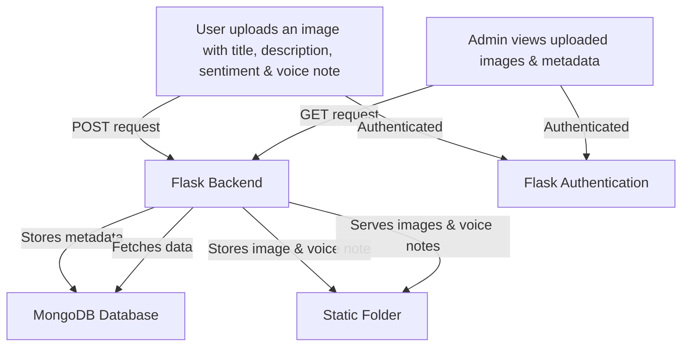

# Beehive  


A Data Federation Approach to Analyze Behavioral Health and Complement Healthcare Practice with Community Health Metrics  

## Project Description  

This project aims to analyze behavioral health and complement healthcare practice with community health metrics in Alaska using a data federation approach. By leveraging data from various sources, we can gain insights into behavioral health patterns and improve healthcare practices in the community.  

## Tech Stacks Used  
- **Language/Framework**: Flask (Python)  
- **Authentication**: Google OAuth2  
- **Database**: MongoDB
  
## Workflow


## Setup Instructions  

If you want to run this project locally, see the [setup.md](DOCS/setup.md).  

## Contributing  

**Note**: This is the `dev` branch, which is our main development branch. Please make sure to create pull requests against this branch if you are contributing to ongoing development. For specific contribution guidelines, see the [contributing.md](DOCS/contributing.md).  
> **NOTE:**  
> We currently have **two active branches** for development:  
>  
> - **`modular` Branch** – Focused on modularizing the codebase.  
> - **`dev` Branch** – General development and feature updates.  
>  
> You are welcome to contribute to **either of these branches** based on your interest.  
> However, please note that the **`main` branch is frozen for now** and not open for direct contributions.  


## License  

This project is licensed under the BSD-3-Clause License. See the [LICENSE](LICENSE) file for more details.

## Testing

This project uses pytest as its testing framework. To run the tests:

1. Install test dependencies:
```bash
pip install -r requirements.txt
```

2. Run the tests:
```bash
pytest
```

To run tests with coverage report:
```bash
pytest --cov=app --cov-report=term-missing
```

### Writing Tests

- All tests are located in the `tests/` directory
- Test files should be named `test_*.py`
- Test functions should be named `test_*`
- Use fixtures from `conftest.py` for common test setup
- Follow the existing test structure and patterns

### Continuous Integration

Tests are automatically run on all pull requests to main and dev branches using GitHub Actions. The workflow configuration can be found in `.github/workflows/tests.yml`.

## Testing Framework Implementation (Issue #164)

This PR implements a comprehensive testing framework for the Beehive application, including:

### Changes Made
- Created and organized test directory structure
- Implemented test fixtures in `conftest.py`
- Added authentication tests in `test_auth.py`
- Added file upload tests in `test_upload.py`
- Improved test coverage to 64%
- Added GitHub Actions workflow for automated testing

### Test Coverage
- Current coverage: 64% (326/508 statements)
- Key areas covered:
  - User authentication
  - File uploads
  - Admin functionality
  - Route handling

### Documentation
- Added testing documentation to README.md
- Included instructions for:
  - Running tests
  - Generating coverage reports
  - Writing new tests

### Notes
- All core functionality tests are passing
- Google OAuth tests need separate attention (tracked in separate issue)
