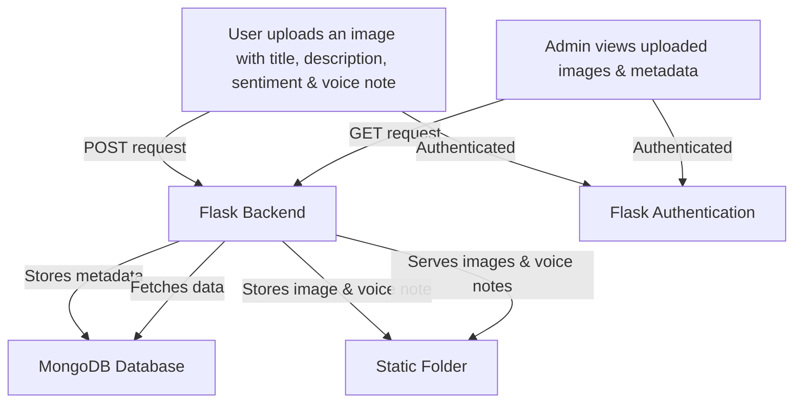

# Beehive  

A Data Framework for Behavioral Health with Digitized Drawings and Photographs. 

## Project Description  

This project aims to analyze behavioral health and complement healthcare practice with community health metrics in Alaska using a data federation approach. By leveraging data from various sources, we can gain insights into behavioral health patterns and improve healthcare practices in the community.

## Tech Stacks Used  
- **Language/Framework**: Flask (Python)
- **Authentication**: Google OAuth2
- **Database**: MongoDB
  
## Workflow

## Setup Instructions  

For instructions to configure and run this project locally, see the [setup.md](docs/setup.md).

## Contributing  

**Note**: `dev` branch is our primary development branch. The `main` branch is our stable branch. Please create pull requests against the dev branch if you are contributing to ongoing development. For specific contribution guidelines, see the [contributing.md](docs/contributing.md).

The **`main` branch is frozen** for direct commits and only pull requests from a stable development branch are merged into the main branch.

