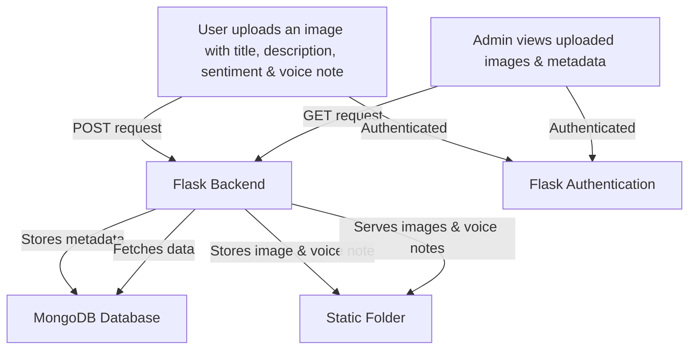

# Beehive  

A Data Federation Approach to Analyze Behavioral Health and Complement Healthcare Practice with Community Health Metrics  

## Project Description  

This project aims to analyze behavioral health and complement healthcare practice with community health metrics in Alaska using a data federation approach. By leveraging data from various sources, we can gain insights into behavioral health patterns and improve healthcare practices in the community.  

## Tech Stacks Used  
- **Language/Framework**: Flask (Python)  
- **Authentication**: Google OAuth2  
- **Database**: MongoDB
  
## Workflow

## Setup Instructions  

If you want to run this project locally, see the [setup.md](DOCS/setup.md).  

## Contributing  

**Note**: This is the `dev` branch, which is our main development branch. Please make sure to create pull requests against this branch if you are contributing to ongoing development. For specific contribution guidelines, see the [contributing.md](DOCS/contributing.md).  
> **NOTE:**  
> We currently have **two active branches** for development:  
>  
> - **`modular` Branch** – Focused on modularizing the codebase.  
> - **`dev` Branch** – General development and feature updates.  
>  
> You are welcome to contribute to **either of these branches** based on your interest.  
> However, please note that the **`main` branch is frozen for now** and not open for direct contributions.  

## License  

This project is licensed under the BSD-3-Clause License. See the [LICENSE](LICENSE) file for more details.
