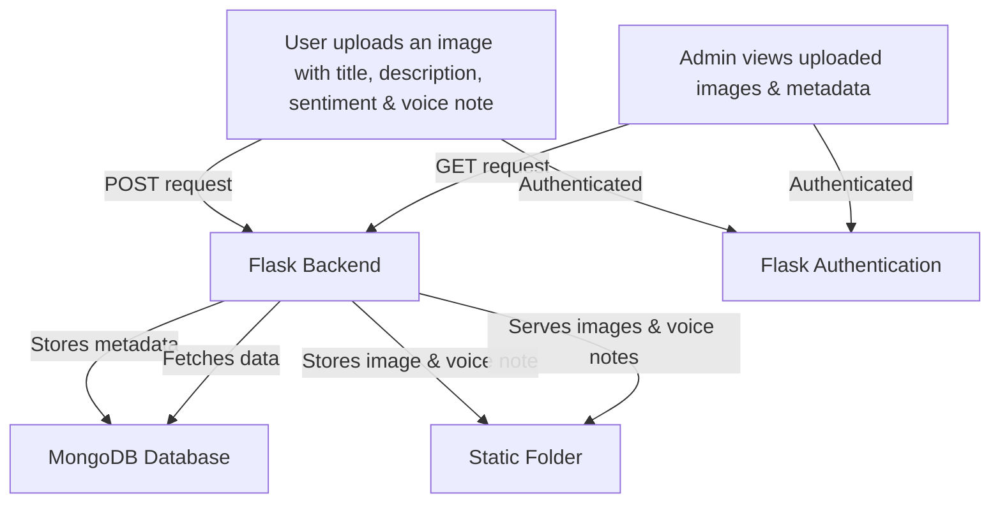

# Beehive  

A Data Framework for Behavioral Health with Digitized Drawings and Photographs. 

## Project Description  

This project aims to analyze behavioral health and complement healthcare practice with community health metrics in Alaska using a data federation approach. By leveraging data from various sources, we can gain insights into behavioral health patterns and improve healthcare practices in the community.

## Tech Stacks Used  
- **Backend**: Flask (Python)
- **Frontend**: React (TypeScript) in `frontend/`
- **User Authentication**: Google OAuth2
- **Local Authentication**: JWT-based auth with optional Google OAuth for admin
- **Database**: MongoDB
- **Storage**: Local filesystem for media uploads in `static/uploads/` with PDF thumbnails in `static/uploads/thumbnails/`
  
## Workflow

```mermaid
graph TD;
  User["User uploads an image with title, description, sentiment & voice note"] -->|POST request| Backend[Flask Backend]
  Backend -->|Stores metadata| MongoDB[MongoDB Database]
  Backend -->|Stores image & voice note| StaticFolder[Static Folder]
  Admin["Admin views uploaded images & metadata"] -->|GET request| Backend
  Backend -->|Fetches data| MongoDB
  Backend -->|Serves images & voice notes| StaticFolder
  User & Admin -->|Authenticated| Auth[Flask Authentication]

```

## Architecture Overview

The system follows a simple client–server architecture:

1. Users upload images with metadata such as title, description, sentiment, and voice notes.
2. The Flask backend processes the request and stores metadata in MongoDB.
3. Media files (images and voice notes) are stored in the local filesystem under static/uploads/.
4. Administrators can view uploaded data through authenticated endpoints.

## Quick Start

1. Clone the repository

git clone https://github.com/kathiravelulab/beehive.git
cd beehive

2. Create a virtual environment

python -m venv venv

Activate it:
Linux / macOS: 
source venv/bin/activate

Windows: 
venv\Scripts\activate

3. Install dependencies

pip install -r requirements.txt

4. Configure environment variables

Create a .env file in the project root and add the required variables:

MONGO_DB_URL=<your_mongodb_connection_string> JWT_SECRET=<your_secret_key>

5. Run the backend server

python app.py

The server will start at: http://127.0.0.1:5000

## Setup Instructions  

For instructions to configure and run this project locally, see the [setup.md](docs/setup.md).

## GitHub Stars

## Contributing  

`dev` branch is our primary development branch. The `main` branch is our stable branch. Please create pull requests against the dev branch if you are contributing to ongoing development. For specific contribution guidelines, see the [contributing.md](docs/contributing.md).

## Citation

If you use this work in your research, please cite the following publication:

* Abdullah, M. F, Kwon, J., Bagwan, Gupta, I., Moxley, D., and Kathiravelu, P. **A Data Framework for Behavioral Health with Digitized Drawings and Photographs.** In _the 20th Annual IEEE International Systems Conference (SysCon)._ Accepted. 8 pages. April 2026. 
